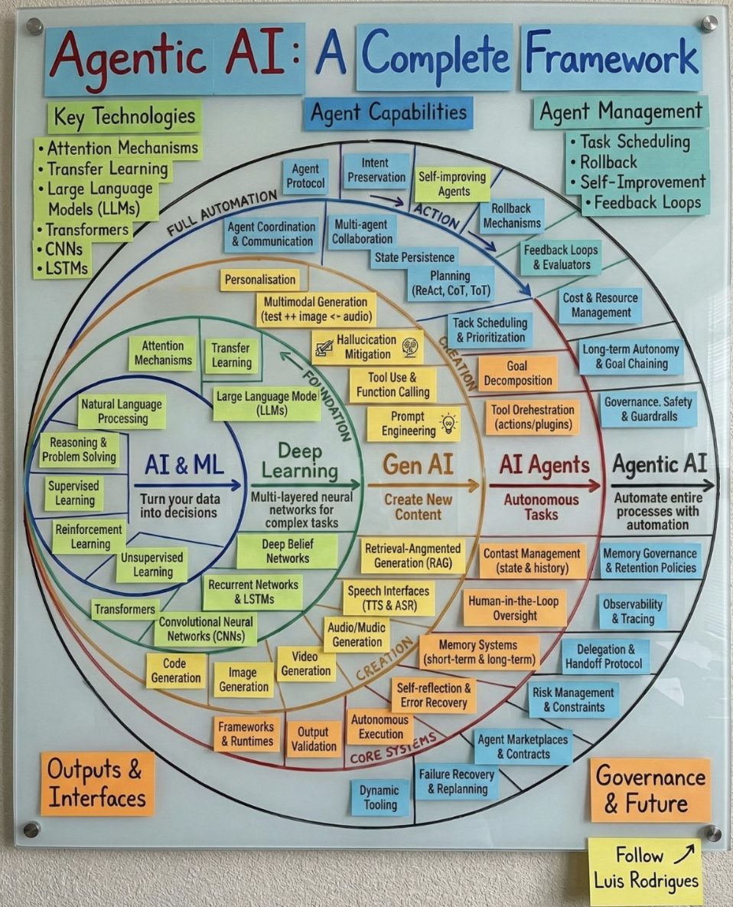
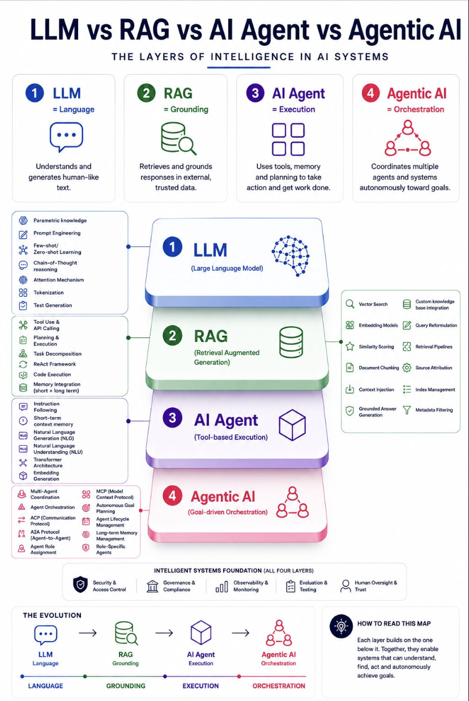

# Outskill — Generative AI & Claude Mastermind Notes

A personal learning repository built from the **Outskill** Generative AI / Claude AI
mastermind. It captures the mastermind's concepts and adds hands-on notes for
building with **Claude**. Work through the topics top-to-bottom; each folder has
its own notes in Markdown.

→ Full breakdown: [Agentic AI: A Complete Framework](./notes/agentic-ai-framework.md)

→ Full breakdown: [LLM vs RAG vs AI Agent vs Agentic AI](./notes/llm-rag-agent-agentic.md)

## Learning Path

### [Part 1 — Generative AI Foundations](./generative-ai/README.md)
Understand what generative AI is and how the underlying models work.

1. [Introduction to Generative AI](./generative-ai/01-introduction.md) — what it is, where it came from, key terms
2. [How Language Models Work](./generative-ai/02-how-llms-work.md) — tokens, transformers, next-token prediction
3. [Training & Fine-Tuning](./generative-ai/03-training-and-finetuning.md) — pre-training, RLHF, alignment
4. [Context, Memory & Limits](./generative-ai/04-context-and-memory.md) — context windows, embeddings, RAG
5. [Prompt Engineering Basics](./generative-ai/05-prompt-engineering.md) — prompting patterns that work
6. [Limitations & Risks](./generative-ai/06-limitations-and-risks.md) — hallucination, bias, safety

### [Part 2 — Building with Claude](./claude/README.md)
Apply the foundations using Anthropic's Claude models and APIs.

1. [Claude Overview](./claude/01-claude-overview.md) — models, capabilities, use cases
2. [Using the Claude API](./claude/02-api-basics.md) — requests, messages, parameters
3. [Prompt Engineering with Claude](./claude/03-prompting-claude.md) — system prompts, roles, examples
4. [Tools & Extended Features](./claude/04-tools-and-features.md) — tool use, long context, projects
5. [Choosing a Model](./claude/05-choosing-a-model.md) — tier-to-task, OpenRouter, getmulti
6. [Skills & SOPs](./claude/06-skills-and-sops.md) — reusable instruction recipes, DocX/PPTX
7. [Hands-On Claude](./claude/07-hands-on-claude.md) — file analysis, Artifacts, Chrome extension

### [Part 3 — Personal Notes](./notes/README.md)
Free-form notes, summaries, and experiments.

- [AI Skill Levels](./notes/ai-skill-levels.md) — the AI-fluency ladder from the mastermind
- [AI Tools Demonstrated](./notes/ai-tools.md) — practical AI tools by workflow
- [Agentic AI: A Complete Framework](./notes/agentic-ai-framework.md) — the 5-ring AI→Agentic map
- [LLM vs RAG vs AI Agent vs Agentic AI](./notes/llm-rag-agent-agentic.md) — the 4-layer intelligence stack
- [What is an AI Agent?](./notes/what-is-an-ai-agent.md) — perceive → think → act → achieve
- [Agent-Human Architecture](./notes/agent-human-architecture.md) — the 4 human roles as agents do more
- [My Notes](./notes/) — your own running notes as you learn

## How to Use This Repo

- Read each file in order; links are numbered for sequence.
- Take notes in `notes/` as you go — summarize in your own words.
- Star topics you want to revisit. Open issues for questions to research later.

## Progress Tracking

- [ ] Part 1 — Generative AI Foundations
- [ ] Part 2 — Building with Claude
- [ ] Hands-on project (TBD)
