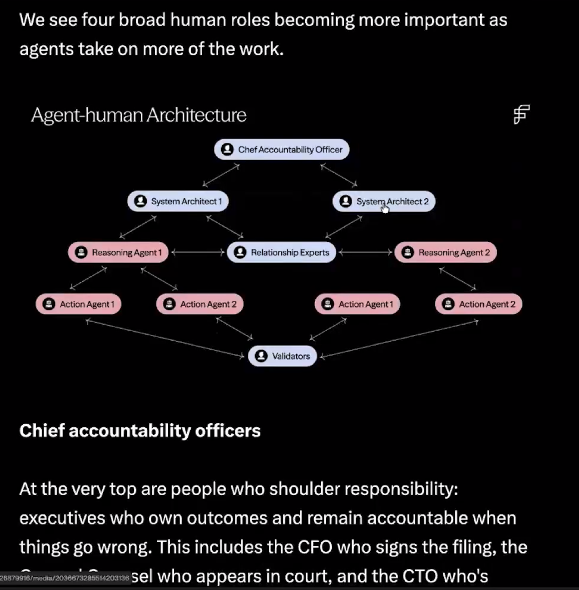

# Agent-Human Architecture



As agents take on more of the *doing*, four human roles become **more** important,
not less. Agents reason and act; humans own **accountability, architecture,
relationships, and validation**.

> Source: mastermind diagram "Agent-human Architecture." Reproduced as text
> below.

## The four human roles

| Role | Owns | Why it grows as agents do more |
|------|------|--------------------------------|
| **Chief Accountability Officer** | Outcomes & liability | Someone must answer when an agent errs; executives carry final accountability. |
| **System Architect** | How agents + humans fit | Designs the agent system, its boundaries, and handoffs. |
| **Relationship Experts** | Human judgment & trust | The ethics, rapport, and nuance no agent replaces. |
| **Validators** | Did it actually pass? | The final gate before an agent's work ships or executes. |

## The hierarchy

```
              Chief Accountability Officer   (human)
                        |
          +-------------+-------------+
          |                           |
   System Architect 1          System Architect 2   (human)
          |                           |
   Reasoning Agent 1          Reasoning Agent 2     (agent)
          |                           |
   +------+------+             +------+------+
   |             |             |             |
 Action Agent 1 Action Agent 2 Action Agent 1 Action Agent 2  (agent)
          \             \       /             /
           \             \     /             /
            \             \   /             /
                 Validators                  (human)
```

- **Top:** a human **Chief Accountability Officer** owns the outcome.
- **Architects (human):** design the system; each supervises a reasoning agent.
- **Reasoning agents:** plan and decide; each drives action agents.
- **Action agents:** execute (call tools, take steps).
- **Relationship Experts (human):** the human-judgment hub between architects
  and agents.
- **Validators (human):** the final gate — every action agent's output flows
  here before it counts.

## The split: agents do, humans own

| Layer | Who | Job |
|-------|-----|-----|
| Accountability | Human | Own outcomes and liability |
| Architecture | Human | Design the system and handoffs |
| Reasoning | Agent | Plan, decide |
| Action | Agent | Execute via tools |
| Relationships | Human | Trust, ethics, judgment |
| Validation | Human | Approve before ship |

## Chief accountability officers

These are executives who shoulder responsibility — the **CFO** who signs the
filing, the **CTO** who owns the system, the **SEL** who appears in court. When
an autonomous system fails, accountability still sits with a human at the top.

## Where this fits in the repo

- Governance pillars (security, governance, observability, evaluation, human
  oversight): [LLM vs RAG vs AI Agent vs Agentic AI](./llm-rag-agent-agentic.md)
- The Agentic AI layer (governance, safety, human-in-the-loop):
  [Agentic AI: A Complete Framework](./agentic-ai-framework.md)
- What an agent is and does: [What is an AI Agent?](./what-is-an-ai-agent.md)

## Recap

- As agents do more, four human roles matter more: **accountability,
  architecture, relationships, validation**.
- Agents reason and act; humans own outcomes and the final yes/no.
- Keep a Chief Accountability Officer, System Architects, Relationship Experts,
  and Validators in the loop.

---

**See also:** [What is an AI Agent?](./what-is-an-ai-agent.md) ·
[Back to README](../README.md)
